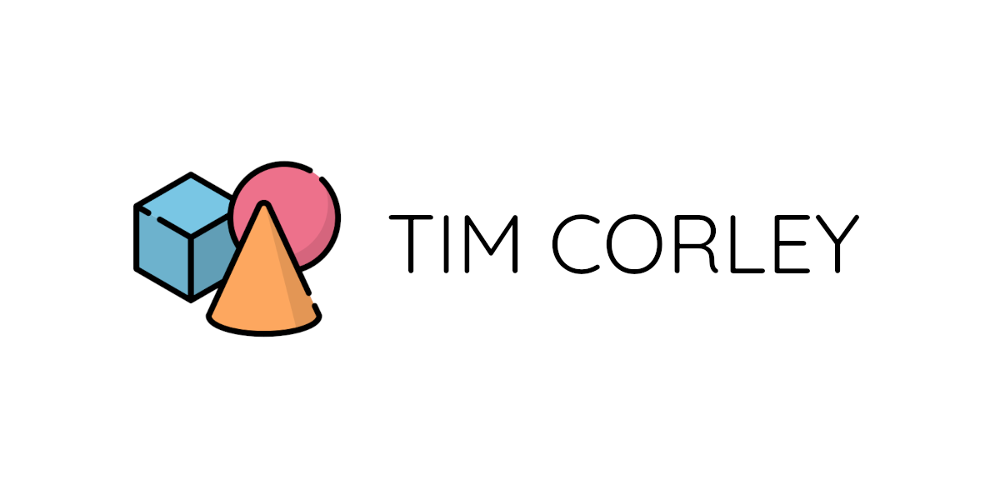

<!-- PROJECT HEADER -->
 

  

  <h1 align="center">My Web Portfolio & Blog Site</h1>

  

    A place to browse my blog posts, check out my projects, and to get in touch.
     
     
    <a href="https://github.com/tim-corley/tc-portfolio/issues">Report an Issue</a>
  

    

    <h3>Built With:<h3>
      
    
  

<!-- TABLE OF CONTENTS -->

  
Table of Contents

  <ol>
    <li>
      <a href="#about-the-project">About The Project</a>
      <ul>
        <li><a href="#features">Features</a></li>
        <li><a href="#built-with">Built With</a></li>
      </ul>
    </li>
      <li><a href="#contact">Contact</a></li>
  </ol>

<!-- ABOUT THE PROJECT -->
## About The Project

This is the code for a public-facing website intended to showcase some of my work - including blog posts & projects - and to provide contact information. It was develop & deployed using modern web application technologies such as React, JSX, MDX, Serverside Rendering, and Git/GitHub. 
### Features
- Easy styling customization with [Tailwind 2.0](https://blog.tailwindcss.com/tailwindcss-v2)
- Near perfect lighthouse score - [Lighthouse Audit Report](https://www.tim-corley.dev/audit)
- Lightweight
- Mobile-friendly view
- Light and dark theme
- [MDX - write JSX in markdown documents!](https://mdxjs.com/)
- Server-side syntax highlighting with [rehype-prism](https://github.com/mapbox/rehype-prism)
- Automatic image optimization via [next/image](https://nextjs.org/docs/basic-features/image-optimization)
- Flexible data retrieval with [next-mdx-remote](https://github.com/hashicorp/next-mdx-remote)
- Contact form support via [nodemailer](https://nodemailer.com/about/)
- Hosted by [Vercel](https://vercel.com/)

### Built With

* [Next.js](https://nextjs.org/)
* [Tailwind CSS](https://tailwindcss.com/)

<!-- CONTACT -->
## Contact

Tim Corley | [@tcor215](https://twitter.com/tcor215) | contact@tim-corley.dev
